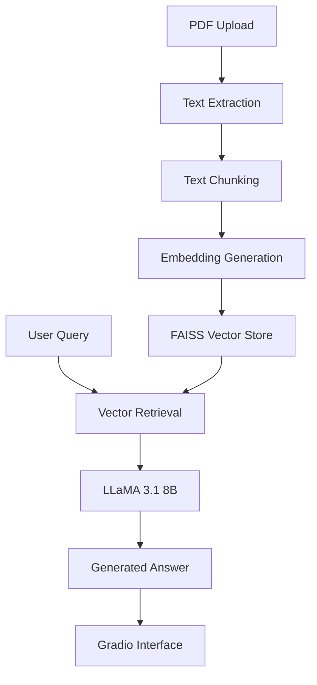

# 📄 DoChat+ — Offline AI-Powered Document Intelligence Chatbot

[](https://www.python.org/downloads/)
[](https://opensource.org/licenses/MIT)
[](https://gradio.app/)
[](https://ollama.ai/)

## 🎯 Overview

DoChat+ is a **privacy-preserving, offline document intelligence chatbot** that enables users to upload PDF documents and interact with them using natural language queries. Built with **LLaMA 3.1 8B** and **RAG (Retrieval-Augmented Generation)**, it provides accurate answers, summaries, and insights—all processed locally without internet connectivity.

### 🌟 Key Features

- **🔒 100% Offline**: No cloud dependencies, complete data privacy
- **📚 Intelligent Q&A**: Ask questions about your documents in natural language
- **📝 Document Summarization**: Generate comprehensive summaries with one click
- **🔍 Advanced Retrieval**: MMR-based vector search for relevant context
- **📊 Visual Interface**: Clean, modern Gradio-based web UI
- **💾 Export Options**: Download chat history and results
- **🔧 Modular Design**: Easy to customize and extend
- **⚡ High Performance**: Optimized for local deployment

## 🏗️ Architecture



### Tech Stack

- **Frontend**: Gradio 4.x (Modern web interface)
- **Backend**: Python with FastAPI-style architecture
- **LLM**: LLaMA 3.1 8B via Ollama
- **Embeddings**: Sentence Transformers (all-MiniLM-L6-v2)
- **Vector Database**: FAISS (Facebook AI Similarity Search)
- **PDF Processing**: PyPDF
- **Framework**: LangChain for RAG pipeline

## 🚀 Quick Start

### Prerequisites

- **Python 3.8+**
- **4GB+ RAM** (8GB recommended)
- **Ollama** installed and running
- **CUDA-compatible GPU** (optional, for better performance)

### 1. Install Ollama

```bash
# Linux/macOS
curl -fsSL https://ollama.ai/install.sh | sh

# Windows: Download from https://ollama.ai/download
```

### 2. Pull the LLaMA Model

```bash
# Pull the recommended model (5.5GB)
ollama pull llama3.1:8b-instruct-q5_K_M

# Alternative: Smaller model (4.1GB)
ollama pull llama3.1:8b-instruct-q4_0

# Alternative: Larger model (40GB) - for better quality
ollama pull llama3.1:70b-instruct-q4_K_M
```

### 3. Clone and Setup

```bash
# Clone the repository
git clone https://github.com/yourusername/dochat-plus.git
cd dochat-plus

# Create virtual environment
python -m venv dochat_env
source dochat_env/bin/activate  # Linux/macOS
# or
dochat_env\Scripts\activate     # Windows

# Install dependencies
pip install -r requirements.txt
```

### 4. Run the Application

```bash
# Start the application
python app.py

# Access the web interface
# Open your browser to: http://localhost:7860
```

## 📖 Usage Guide

### Basic Usage

1. **Upload PDF**: Click "📁 Upload PDF Document" and select your file
2. **Wait for Processing**: The system will extract text and build the RAG index
3. **Ask Questions**: Type your questions in the chat interface
4. **Get Summaries**: Switch to "Summarize" mode for document overviews
5. **Export Results**: Use "💾 Export Chat History" to save conversations

### Advanced Features

#### Page Navigation
- Use "⬅️ Previous" and "➡️ Next" buttons to browse document pages
- Preview shows page content for context

#### Query Types
- **Factual Questions**: "What is the main conclusion of this research?"
- **Analytical Questions**: "Compare the pros and cons mentioned in section 3"
- **Summarization**: "Summarize the key findings"
- **Specific Searches**: "Find information about methodology"

#### Export Options
- **Chat History**: Download complete conversation as text file
- **Timestamped**: Files include creation timestamp for organization

## ⚙️ Configuration

### Environment Variables

```bash
# Model configuration
export DOCHAT_OLLAMA_MODEL="llama3.1:8b-instruct-q5_K_M"
export DOCHAT_EMBEDDING_MODEL="all-MiniLM-L6-v2"

# Server configuration
export DOCHAT_HOST="0.0.0.0"
export DOCHAT_PORT="7860"

# Logging
export DOCHAT_LOG_LEVEL="INFO"
```

### Configuration File

Edit `config/settings.py` to customize:

- **Model Settings**: Change LLM and embedding models
- **RAG Parameters**: Adjust chunk size, retrieval settings
- **UI Preferences**: Modify interface appearance
- **Performance**: Tune memory and processing options

### Model Options

| Model | Size | Memory | Quality | Speed |
|-------|------|--------|---------|-------|
| `llama3.1:8b-instruct-q4_0` | 4.1GB | 6GB | Good | Fast |
| `llama3.1:8b-instruct-q5_K_M` | 5.5GB | 8GB | Better | Medium |
| `llama3.1:70b-instruct-q4_K_M` | 40GB | 48GB | Best | Slow |
| `mistral:7b-instruct-v0.3-q5_K_M` | 4.9GB | 7GB | Good | Fast |

## 🐳 Docker Deployment

### Build and Run

```bash
# Build the Docker image
docker build -t dochat-plus .

# Run the container
docker run -p 7860:7860 -v $(pwd)/exports:/app/exports dochat-plus

# With GPU support (if available)
docker run --gpus all -p 7860:7860 -v $(pwd)/exports:/app/exports dochat-plus
```

### Docker Compose

```yaml
version: '3.8'
services:
  dochat:
    build: .
    ports:
      - "7860:7860"
    volumes:
      - ./exports:/app/exports
      - ./logs:/app/logs
    environment:
      - DOCHAT_LOG_LEVEL=INFO
```

## 🔧 Development

### Project Structure

```
dochat-plus/
├── app.py                 # Main application
├── requirements.txt       # Python dependencies
├── config/
│   └── settings.py       # Configuration settings
├── docs/                 # Documentation
├── exports/              # Exported files
├── logs/                 # Application logs
├── Dockerfile           # Docker configuration
└── README.md           # This file
```

### Adding New Features

1. **Custom Models**: Modify `config/settings.py` to add new Ollama models
2. **Export Formats**: Extend `export_history()` function for new formats
3. **UI Themes**: Customize Gradio theme in `create_interface()`
4. **OCR Support**: Enable OCR in config for scanned PDFs

### Testing

```bash
# Run with debug logging
DOCHAT_LOG_LEVEL=DEBUG python app.py

# Test with sample documents
# Place test PDFs in docs/ directory
```

## 🚨 Troubleshooting

### Common Issues

#### Ollama Not Running
```bash
# Check Ollama status
ollama list

# Start Ollama service (if needed)
ollama serve
```

#### Model Not Found
```bash
# Check available models
ollama list

# Pull required model
ollama pull llama3.1:8b-instruct-q5_K_M
```

#### Memory Issues
- Reduce `CHUNK_SIZE` in config
- Use smaller model variant
- Increase system swap space

#### PDF Processing Errors
- Ensure PDF is not password-protected
- Check file size (default limit: 50MB)
- Try re-saving PDF in standard format

### Performance Optimization

1. **GPU Acceleration**: Set `EMBEDDING_DEVICE="cuda"` in config
2. **Memory Management**: Enable `ENABLE_MEMORY_OPTIMIZATION`
3. **Batch Processing**: Adjust `BATCH_SIZE` for embedding generation
4. **Model Selection**: Use faster models for real-time applications

## 🔒 Security & Privacy

- **No Internet Required**: All processing happens locally
- **Data Privacy**: Documents never leave your machine
- **Secure Processing**: No cloud APIs or external services
- **File Validation**: Built-in security checks for uploads

## 🤝 Contributing

1. Fork the repository
2. Create a feature branch (`git checkout -b feature/amazing-feature`)
3. Commit your changes (`git commit -m 'Add amazing feature'`)
4. Push to the branch (`git push origin feature/amazing-feature`)
5. Open a Pull Request

### Development Setup

```bash
# Install development dependencies
pip install -r requirements.txt
pip install black flake8 pytest

# Format code
black app.py

# Run linting
flake8 app.py

# Run tests
pytest tests/
```

## 📊 Performance Benchmarks

| Document Size | Processing Time | Memory Usage | Query Response |
|---------------|----------------|--------------|----------------|
| 10 pages | 15 seconds | 2GB | 3-5 seconds |
| 50 pages | 45 seconds | 4GB | 4-6 seconds |
| 100 pages | 90 seconds | 6GB | 5-8 seconds |
| 500 pages | 7 minutes | 12GB | 8-12 seconds |

*Benchmarks on Intel i7-10700K, 32GB RAM, RTX 3080*

## 🗺️ Roadmap

### Version 1.1
- [ ] OCR support for scanned PDFs
- [ ] Multiple document support
- [ ] Advanced export formats (DOCX, JSON)
- [ ] REST API endpoints

### Version 1.2
- [ ] Multimodal support (images + text)
- [ ] Document comparison features
- [ ] Advanced search filters
- [ ] User authentication

### Version 2.0
- [ ] Cloud deployment options
- [ ] Multi-language support
- [ ] Plugin system
- [ ] Advanced analytics

## 📄 License

This project is licensed under the MIT License - see the [LICENSE](LICENSE) file for details.

## 🙏 Acknowledgments

- **Meta AI** for LLaMA models
- **Ollama** for local LLM serving
- **Gradio** for the amazing web interface
- **LangChain** for RAG framework
- **Hugging Face** for embedding models
- **Facebook Research** for FAISS

## 📞 Support

- **Issues**: [GitHub Issues](https://github.com/yourusername/dochat-plus/issues)
- **Discussions**: [GitHub Discussions](https://github.com/yourusername/dochat-plus/discussions)
- **Email**: support@dochat-plus.com

---

**Made with ❤️ for privacy-conscious document analysis**